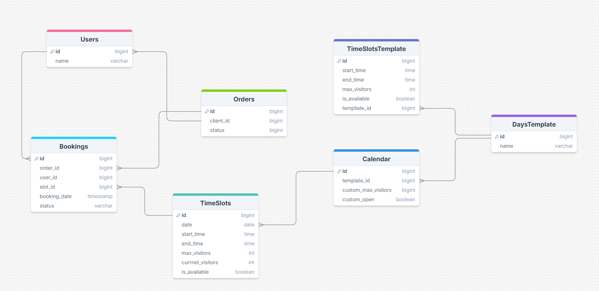

# Система записи в бассейн

Система управления записями клиентов в бассейн с гибким расписанием

## 🗃️ Структура базы данных

**Поля изменены в проекте**

Основные таблицы:

| Таблица                | Описание |
|------------------------|----------|
| `day_templates`        | Шаблоны дней (будни/выходные) |
| `time_slots_template`  | Расписание для шаблонов |
| `calendar`             | Календарь дат |
| `time_slots`           | Сгенерированные слоты |
| `clients`              | Данные клиентов |
| `booking`             | Бронирования |
| `orders`              | Заказы (группы бронирований) |

**Бизнес-логика:**
- Хранимая процедура `update_visitors_count` - подсчет записавшихся
- Триггер `after_booking_change` - автообновление при изменении броней

## 📚 API Документация

Полная документация доступна через Swagger UI:  
🔗 [http://localhost:8080/swagger-ui.html](http://localhost:8080/swagger-ui.html)

Для начала работы необходимо в порядке очереди запустить данные эндпоинты:

| Метод | URL | Описание                      |
|-------|-----|-------------------------------|
| `POST` | `/api/v0/pool/calendar/generate` | Генерация календаря (30 дней) |
| `POST` | `/api/v0/pool/calendar/generate-weekly-slots` | Генерация слотов на неделю    |